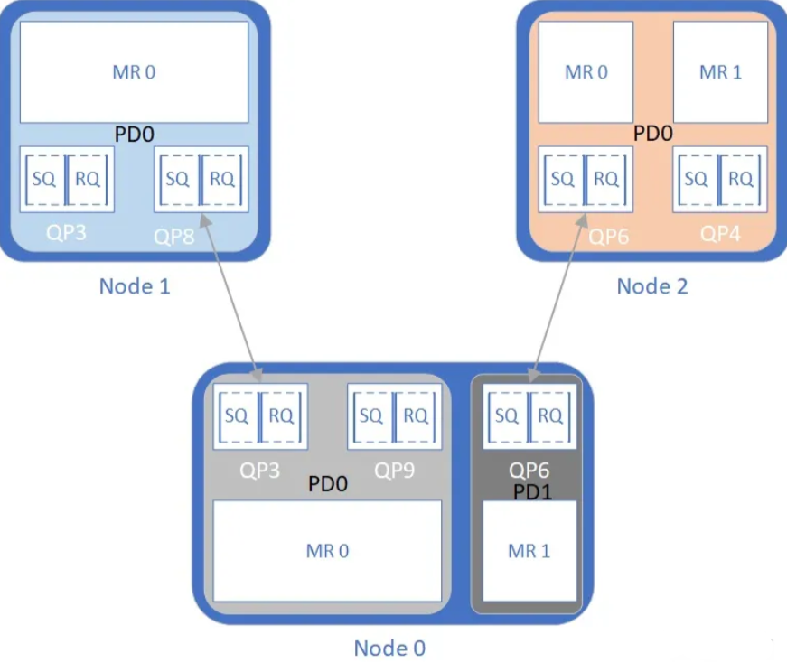

- [RDMA-example学习笔记](#rdma-example学习笔记)
	- [项目结构](#项目结构)
	- [文件执行流](#文件执行流)
		- [server执行流](#server执行流)
			- [1. 获取监听IP地址与端口](#1-获取监听ip地址与端口)
			- [2. 启动监听程序与等待client链接](#2-启动监听程序与等待client链接)
			- [3. 创建与client端传来的QP对应的QP](#3-创建与client端传来的qp对应的qp)
			- [4. 注册接收client元数据的内存区域client\_metadata\_mr、创建接收工作请求，接受来自client端的链接请求](#4-注册接收client元数据的内存区域client_metadata_mr创建接收工作请求接受来自client端的链接请求)
			- [5. 与client端交换元数据](#5-与client端交换元数据)
			- [6. 断开连接](#6-断开连接)
		- [client执行流](#client执行流)
			- [1. 获得目标服务器的通信地址与所需传输的数据](#1-获得目标服务器的通信地址与所需传输的数据)
			- [2. 链接前对RDMA通信所需的各项资源进行准备](#2-链接前对rdma通信所需的各项资源进行准备)
			- [3. 注册server端元数据接收内存区域server\_metadata\_mr与创建接收工作请求](#3-注册server端元数据接收内存区域server_metadata_mr与创建接收工作请求)
			- [4. 与server端建立连接](#4-与server端建立连接)
			- [5. 与server端交换元数据](#5-与server端交换元数据)
			- [6. cilent端对server端的远程数据访问](#6-cilent端对server端的远程数据访问)
			- [7. 验证通信正常](#7-验证通信正常)
			- [8. 断开链接](#8-断开链接)
	- [结语](#结语)

# RDMA-example学习笔记
---
&emsp; 该项目来源于github开源项目[rdma-example](https://github.com/animeshtrivedi/rdma-example)，项目使用RDMA开发库librdmacm与libverbs分别完成了服务器与客户端之间的链接建立与数据访问，这其中涉及了RDMA的四项基本操作send/receive、write/read。在结合[rdma-core源码](https://github.com/linux-rdma/rdma-core)的同时对此项目进行解构能够有效加深初学者对RDMA的整体理解。以下是我对这个项目的学习笔记。
## 项目结构
```
rdma-example(此处省略了CMake工程文件与其生成的Makefile文件)
    ├── bin
    │   ├── rdma_client             #客户端可执行文件
    │   └── rdma_server             #服务端可执行文件
    ├── CMakeLists.txt              #CMake文件
    ├── LICENSE
    ├── README.md                   #项目说明
    └── src                         #项目文件
        ├── rdma_client.c           #客户端源文件
        ├── rdma_common.c           #通用函数
        ├── rdma_common.h
        └── rdma_server.c           #服务端源文件
```
## 文件执行流
&emsp; 如上一节所示，除去通用的功能函数后，其执行流可清晰地被划分成server与client两条，总体而言，这两条执行流相对平行，但也会因为等待对方的信息而陷入阻塞状态，下面会对其分别进行说明，但为了更好的书写与整理思路，我会在两条执行流间进行跳转，相应文字处会进行说明。
### server执行流
&emsp; 引用[rdma_cm(7) - Linux man page](https://linux.die.net/man/7/rdma_cm)对服务器与客户端之间使用rdma_cm通信建链过程的描述，server端进行建链的过程如下所示，本项目server端的执行流的建链过程与之相似。
```
1. rdma_create_event_channel
create channel to receive events
2. rdma_create_id
allocate an rdma_cm_id, this is conceptually similar to a socket
3. rdma_bind_addr
set the local port number to listen on
4. rdma_listen
begin listening for connection requests
5. rdma_get_cm_event
wait for RDMA_CM_EVENT_CONNECT_REQUEST event with a new rdma_cm_id
6. rdma_create_qp
allocate a QP for the communication on the new rdma_cm_id
7. rdma_accept
accept the connection request
8. rdma_ack_cm_event
ack event
9. rdma_get_cm_event
wait for RDMA_CM_EVENT_ESTABLISHED event
10. rdma_ack_cm_event
ack event

...Perform data transfers over connection   #此过程主要使用libverbs库，用于建链完成后的数据传输

11. rdma_get_cm_event
wait for RDMA_CM_EVENT_DISCONNECTED event
12. rdma_ack_cm_event
ack event
13. rdma_disconnect
tear-down connection
15. rdma_destroy_qp
destroy the QP
16. rdma_destroy_id
release the connected rdma_cm_id
17. rdma_destroy_id
release the listening rdma_cm_id
18. rdma_destroy_event_channel
release the event channel
```
#### 1. 获取监听IP地址与端口
&emsp; 该步主要为下一节启动监听做准备。作为服务器，运行rdma_server的节点需要被动的接收来自client的通信链接请求，这要求该节点需要时刻对特定的IP与端口进行监听，查看是否有来自client的链接请求。总体来说，这一步与一般的socket编程相似，过程大致为检查命令行是否传入指定的IP与端口，若传入，则将监听对象设置为该IP与端口，若没有传入，则监听该节点所有的IP与默认进行RDMA通信的端口。
#### 2. 启动监听程序与等待client链接
&emsp; 该步对应上述建链流程的1-5点，下面逐点对其进行说明：
&emsp; **2.1 建立硬件与应用层之间的通信通道(rdma_create_event_channel)**
&emsp; 由于在RDMA通信中，RNIC在执行通信时发挥了重要作用，例如数据的封装与网络传输都是由RNIC执行的，应用层无法直接得到执行结果，因此一个使应用层能够获得底端内核或RNIC执行结果的通信结构是必要的。
&emsp; 函数rdma_create_event_channel便是用于创建通信通道的函数，在调用该函数后，其会返回一个包含文件描述符fd的结构体rdma_event_channel。在Linux中，fd是已经打开的文件的索引，因此通过该索引应用层可以从文件中得到底层传来的事件，并根据事件执行不同的决策。
&emsp; **2.2 创建链接的抽象(rdma_create_id)**
&emsp; 在RDMA通信中，rdma_create_id的概念与一般网络通信中的socket类似，是链接的一种抽象，应用层可以通过由函数rdma_create_id()得到的rdma_cm_id发送或接收数据，其具体结构如下：
```
struct rdma_cm_id {
	struct ibv_context	*verbs;
	struct rdma_event_channel *channel;
	void			*context;
	struct ibv_qp		*qp;
	struct rdma_route	 route;
	enum rdma_port_space	 ps;
	uint8_t			 port_num;
	struct rdma_cm_event	*event;
	struct ibv_comp_channel *send_cq_channel;
	struct ibv_cq		*send_cq;
	struct ibv_comp_channel *recv_cq_channel;
	struct ibv_cq		*recv_cq;
	struct ibv_srq		*srq;
	struct ibv_pd		*pd;
	enum ibv_qp_type	qp_type;
};
```
&emsp; 结构体中的channel指向2.1节中创建的通道，是应用层获得链接创建信息的通道。
&emsp; 需要注意的是，该阶段创建的是监听所需的rdma_cm_id，而不是后续用于与客户端通信的rdma_cm_id。监听所使用的rdma_cm_id仅能用于监听是否有来自client端的链接请求。server端与client端通信所使用的rdma_cm_id将通过监听成功时由channel返回的事件结构体rdma_cm_event得到，该rdma_cm_id将带有更完整的建链所需的信息。
&emsp; **2.3 将创建的rdma_cm_id与监听IP与端口绑定(rdma_bind_addr)**
&emsp; 由于server端是被动接收来自client端的通信的，因此它无法直接知晓client的IP与端口，这就导致了它需要实时地监听是否有client的通信到达自己的网卡。该步将**2.2**中创建的rdma_cm_id与**1**中指定的IP与端口进行绑定，为后续调用rdma_listen()函数做准备，该绑定过程同时为rdma_cm_id指定了一个具有RDMA通信能力的设备。
&emsp; **2.4 监听(rdma_listen)**
&emsp; 使用rdma_listen监听绑定了本地IP与端口的rdma_cm_id。
&emsp; **2.5 等待来自底层的链接请求事件(rdma_get_cm_event)**
&emsp; 项目对`int rdma_get_cm_event （struct rdma_event_channel *channel， struct rdma_cm_event **event);`函数进行了进一步的封装，编写了`int process_rdma_cm_event(struct rdma_event_channel *echannel, enum rdma_cm_event_type expected_event, struct rdma_cm_event **cm_event)
`函数，该函数能够阻塞的等待channel中产生其所希望的事件。
&emsp; 在该步中，server端阻塞地等待来自client的链接请求（**此处跳转至client执行流1节**），在底层得到来自client的链接请求后，channel中会产生RDMA_CM_EVENT_CONNECT_REQUEST事件，用户层在从channel中得到该事件，并将其传递的信息储存到参数event后，从阻塞中返回，并从event中得到能够与发起链接的client进行通信的`struct rdma_cm_id cm_client_id`，该id包含了来自发起链接的client端的QP等信息。在得到信息后程序调用`int rdma_ack_cm_event (struct rdma_cm_event *event);`释放event所占资源。

#### 3. 创建与client端传来的QP对应的QP
&emsp; 这一届的内容与client执行流的2.4节相似，此处不再说明。

#### 4. 注册接收client元数据的内存区域client_metadata_mr、创建接收工作请求，接受来自client端的链接请求
&emsp; 题目的前两项与client执行流的3节相似，此处不再说明。对于第三项，server端会将经server执行流第3节完善的cm_client_id作为参数传入rdma_accept()函数，之后调用rdma_get_cm_event()函数等待RDMA_CM_EVENT_ESTABLISHED，从而进入阻塞状态。之后的工作与应用层无关，会交由底层完成。首先，server端的底层通过rdma_accept()函数得到cm_client_id，底层通过与client端进行通信，将本端的QP等信息传送到client端完成第二次握手，接着client端回复一个确认信息完成第三次握手。在完成RDMA通信的三次握手后，server与client端的底层会向应用层传递RDMA_CM_EVENT_ESTABLISHED事件，将其从阻塞中唤醒。

#### 5. 与client端交换元数据
&emsp; 如之前所述，本项目在进行通信前需要server与client端进行元数据的交换。在代码结构中，这一过程首先由client端发起。因此server端会先调用ibv_get_cq_event()函数进入阻塞状态，等待之前所上传的接收工作请求的完成通知。（**此处跳转至client执行流5节**）收到来自client的元数据信息时，server端的底层会将其根据receive队列中工作条目所指向的地址与大小进行储存，并且将server端应用层的对应阻塞程序唤醒。
&emsp; 在被唤醒后，server端会根据来自client端元数据的信息注册能够接收client端数据的缓冲区域，接着将该区域的元数据存入server端元数据结构体server_metadata_attr，最后使用ibv_post_send()函数将该元数据结构体传输到client端。同样的，在数据传输完成前server端的应用层会陷入阻塞状态。在接收到该send任务的完成事件后进行苏醒。
&emsp; 在完成上述过程后，本项目已经将自己所注册的缓冲区域的读写权限授予了client端，这之后client端将使用RDMA read/write这一不会被server端应用层感知的方式对该缓冲区域进行读写，因此，server端的应用层在这之后除了等待来自client的断链事件，并没有其它代码需要执行。

#### 6. 断开连接
&emsp; server端调用rdma_get_cm_event()等待RDMA_CM_EVENT_DISCONNECTED事件，从而进入阻塞状态（**此处跳转至client端5节**）。接收到RDMA_CM_EVENT_DISCONNECTED事件后，调用rdma_destroy_qp()等函数释放暂用资源，资源释放后，server端程序结束。

### client执行流
&emsp; 引用[rdma_cm(7) - Linux man page](https://linux.die.net/man/7/rdma_cm)对服务器与客户端之间使用rdma_cm通信建链过程的描述，client端进行建链的过程如下所示，本项目client端的执行流的建链过程与之相似。
```
1. rdma_getaddrinfo
retrieve address information of the destination
2. rdma_create_event_channel
create channel to receive events
3. rdma_create_id
allocate an rdma_cm_id, this is conceptually similar to a socket
4. rdma_resolve_addr
obtain a local RDMA device to reach the remote address
5. rdma_get_cm_event
wait for RDMA_CM_EVENT_ADDR_RESOLVED event
6. rdma_ack_cm_event
ack event
7. rdma_create_qp
allocate a QP for the communication
8. rdma_resolve_route
determine the route to the remote address
9. rdma_get_cm_event
wait for RDMA_CM_EVENT_ROUTE_RESOLVED event
10. rdma_ack_cm_event
ack event
11. rdma_connect
connect to the remote server
12. rdma_get_cm_event
wait for RDMA_CM_EVENT_ESTABLISHED event
13. rdma_ack_cm_event
ack event

...Perform data transfers over connection   #此过程主要使用libverbs库，用于建链完成后的数据传输

14. rdma_disconnect
tear-down connection
15. rdma_get_cm_event
wait for RDMA_CM_EVENT_DISCONNECTED event
16. rdma_ack_cm_event
ack event
17. rdma_destroy_qp
destroy the QP
18. rdma_destroy_id
release the rdma_cm_id
19. rdma_destroy_event_channel
release the event channel
```
#### 1. 获得目标服务器的通信地址与所需传输的数据
&emsp; 作为发起通信的主动方，client需要显示的指定目标服务器的IP与端口，作为后续创建rdma_cm_id的数据，其中端口需要和server端指定的通信端口一致，否则无法进行正常通信。该节涉及到了上述执行流中的第1步，主要是使用getaddrinfo将字符IP地址转化成结构体sockaddr_in。另外，该项目是通过让cilent端向server端使用RDMA write将字符串src写入其指定内存，再用RDMA read从该内存读出数据储存到dst字符数组，通过比较src与dst是否相同来确定通信是否正常进行。其中的src字符串在本节中通过命令行输入。
#### 2. 链接前对RDMA通信所需的各项资源进行准备
&emsp; 该节主要对应上述执行流的2-10步，以下是对其的简单说明：
&emsp; **2.1 链接通道建立(rdma_create_event_channel)与id生成(rdma_create_id)**
&emsp; 该节对应上述执行流的2-3步，这两步的过程与server端的相似，唯一的区别是这里建立的rdma_cm_id不是监听用的，而是后续通信所用的。
&emsp; **2.2 绑定本地RDMA设备，并找到server端的RDMA地址**
&emsp; 该节对应上述执行流的4-6步，主要是使用rdma_resolve_addr()函数通过本地路由表或ARP来得到server端IP地址对应的RDMA地址，并将上一节所生成的cm_client_id与本地的RDMA设备绑定。由于这些过程需要底层内核与网卡的帮助，因此程序会调用rdma_get_cm_event获得RDMA_CM_EVENT_ADDR_RESOLVED事件，以确认这一过程正确执行。最后通过调用rdma_ack_cm_event释放event结构体所占用的资源。
&emsp; 总体来说，该节所作操作主要是为了补全cm_client_id的缺失信息。
&emsp; **2.3 获得路由信息**
&emsp; 该节对应上述执行流的8-10步。这一节主要是通过rdma_resolve_route()函数调用得到cm_client_id对应的路由信息，剩下的rdma_get_cm_event、rdma_ack_cm_event函数调用原因与上一节相似。
&emsp; **2.4 保护域PD、完成队列CQ、工作队列对QP的建立**
&emsp; 在RDMA通信中，QP是server与client之间通信的基本单位，一个应用程序可以包含多个QP，但一个QP只能属于一个应用程序，且对于每一个server端的QP，都有唯一一个处于client端的QP与其对应。rdma_cm的建链过程便可以大致理解成server端的QP与client端的QP之间的建链过程。rdma_create_qp()函数为rdma_cm_id结构体创建了一个QP，在后续调用rdma_connect()函数时，该QP的相应信息会被传到server端，与server端的QP形成联系。
&emsp; RDMA中被远端访问的内存区域MR与QP并没有一一对应的关系，虽然在创建MR时会生成相应的key，防止MR被无权限的程序访问，但key终究只是一串二进制数，存在被试出来的可能。如果远端程序通过与本节点的低权限要求的QP建立了联系，在通过此联系暴力破解了高权限MR的key，则可能造成安全威胁。因此，RDMA-core为QP与MR资源定义了保护域PD，只有和对应MR处于相同PD中的QP才能够对相应内存区域进行访问。任何QP与MR在创建时都会被分配到一个指定或默认PD。PD通过ibv_alloc_pd()函数创建，且与指定RNIC绑定。  
<div align=center>  </div>
&emsp; 对于应用层来说，QP可以理解为一个任务发布栏，程序只需将需要传输或接收的内存地址与数据长度上传到队列中，便可以等待其‘自动’完成了。但实际上，该任务是由RNIC完成的，RNIC在完成应用层要求的任务时，需要通过一种方式通知应用层任务已经完成，这便是完成队列CQ的作用。

&emsp; 每个QP都与一个CQ进行绑定，在内核与RNIC处理完一个QP时，都会生成相应的strut ibv_wc(work completion)传入CQ。应用层可以简单地通过轮询CQ队列查看任务是否完成，但更优的做法是通过通知的方式让应用层得到这一信息。与建立连接创建通道的做法相似，程序可以通过调用ibv_create_comp_channel()函数创建一个用于传递完成信息的通道，并将通道绑定在CQ中，再通过ibv_req_notify_cq()函数让CQ在收到下一个ibv_wc时产生通知，即可在之后进行数据传递时使用该通知对应用层进行唤醒，需要注意的是，用ibv_req_notify_cq()函数只能产生一个通知，在通知产生后，如果不再次调用ibv_req_notify_cq()函数，便不会产生对应的通知。

#### 3. 注册server端元数据接收内存区域server_metadata_mr与创建接收工作请求
&emsp; 在访问远端的内存区域MR时，本节点需要知道该MR的在远端节点的地址、大小与key等信息，项目将这些信息称为元数据。在RDMA中，MR的key分为远端key(rkey)与本地key(lkey)两种。lkey用于识别本节点RNIC是否有访问相应MR的权限，rkey用于识别远端节点是否有直接访问本节点MR的权限。由于RDMA read/write需要远端节点知晓MR的rkey，而RDMA send/receive在远端节点数据到达RNIC时，由RNIC访问QP中的Receive队列进行读写，在这一过程中，RNIC能够获得相应内存区域的lkey，因此在元数据的传输时，需要使用RDMA send/reveice。
&emsp; 而由于远端QP的每一个send都需要本节点QP有一个相应的receive作为对应，因此本项目在进行通信之前，需要在本节点注册相应的接收MR。
&emsp; 本项目首先通过ibv_reg_mr()将结构体server_metadata_attr注册为接收区域，得到struct ibv_mr* server_metadata_mr，该结构体包含了server_metadata_attr的地址，大小，与内存区域的对应key等信息。接着通过将这些信息封装成接收工作请求ibv_recv_wr使用ibv_post_recv()入队到指定QP后，即完成了接收server端元数据的准备工作。

#### 4. 与server端建立连接
&emsp; 使用rdma_connect()函数向server端发起链接请求，该函数的调用会使server端产生RDMA_CM_EVENT_CONNECT_REQUEST事件，将其从**server执行流2.5节**所描述的阻塞状态中唤醒，这一过程实现了RDMA通信三次握手中的第1次。这之后，client应用层会在底层完成剩下两次握手前调用rdma_get_cm_event()函数等待RDMA_CM_EVENT_ESTABLISHED事件，从而进入阻塞状态（**此处返回server执行流2.5节**）。

#### 5. 与server端交换元数据
&emsp; 对于client端来说，其所需传递的数据来自于**server执行流第1节**中由命令行输入，储存在src中的字符串，因此只需使用ibv_reg_mr()函数将其注册为MR，然后将相应信息储存在元数据client_metadata_attr中即可。之后，由于需要将client_metadata_attr传送到server节点，因此client端还需要为其注册MR，然后将该MR所包含的地址、大小、key等信息传入client_send_wr工作请求，接着将该请求通过ibv_post_send()上传到QP中的发送队列。这之后，client端的QP中已经含有一个send与一个receive请求了，为了完成项目所需功能，其会进入阻塞状态直到收到这两个工作请求的完成事件。（**此处跳转到server执行流的5节**）收到这两个事件后，client端与server端的元数据交换完成，client端从阻塞状态苏醒。

#### 6. cilent端对server端的远程数据访问
&emsp; 本节的主要工作是cilent对server端授权给自己的内存区域先后进行write与read写入读回数据。write过程中，client将存在于src缓冲区的由命令行得到的字符串写入server端；read过程中，client端再把其写入server端的字符数据读入到缓冲区dst，用于后续的比较，验证RDMA read/write是否正确执行。RDMA read/write与之前进行的send/receive代码相似，不同之处在于其为单边过程，远端不需准备receive指示其RNIC数据的存储位置，但本节点需要将之前通过交换元数据得到的远端缓冲区的内存地址与key封装到发送消息中，指示数据在远端节点的存储位置。唯一需要注意的便是read/write任务同样通过ibv_post_send()上传到QP的send队列，因为此处的send与receive队列并不表示数据的流向，只代表节点在通信中处于主动发起方或被动接受方。

#### 7. 验证通信正常
&emsp; 本节任务就是将从命令行得到的储存于src的字符串与从server端得到的储存于dst的字符串进行比较，验证通信是否正常，使用memcmp()函数直接比较即可。

#### 8. 断开链接
&emsp; 本项目中，断开链接的过程由client端发起，但实际上连接双方都可以使用 rdma_disconnect()函数发起断开链接的过程。在调用该函数后，应用层会等待RDMA_CM_EVENT_DISCONNECTED事件，从而进入阻塞状态，底层会执行断链操作，执行完成后，应用层会收到事件从阻塞状态苏醒，然后调用rdma_destroy_qp()等函数释放资源。在释放完资源后，client端程序结束。

## 结语
&emsp; 总体来说，本项目能够较好的帮助RDMA初学者理清server端与client端通信过程。